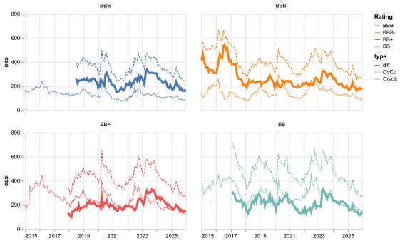

# Credit Examples

© 2025 Marek Ozana

These examples show how to use `polars-bloomberg` for credit bond analysis

-   [{ loading=lazy }](bank-CET1-vs-requirements.ipynb)

    **CET1 Capital vs Requirements and Trigger levels**

    Compare bank capital vs its regulatory requirements and vs AT1 trigger levels

    [:material-open-in-new: Open](bank-CET1-vs-requirements.ipynb)

-   [{ loading=lazy }](bank-capital-history.ipynb)

    **Bank Capital, Asset Quality and Profitability**

    A guided view of three bank "vital signs": **capital (CET1)**, **asset quality (NPL)**, and **profitability (ROE)**, shown as cross-bank averages with dispersion.

    [:material-open-in-new: Open](bank-capital-history.ipynb)

-   [{ loading=lazy }](equity-cushion-vs-spread.ipynb)

    **Equity Cushion vs Credit Spread Analysis**

    Analyze the relationship between company equity cushion and its bonds credit spreads

    [:material-open-in-new: Open](equity-cushion-vs-spread.ipynb)

-   [{ loading=lazy }](at1-valuation.ipynb)

    **AT1 Bond Valuation**

    Explore pricing mechanics and risk sensitivities for Additional Tier 1 (AT1) bonds.

    [:material-open-in-new: Open](at1-valuation.ipynb)

-   [{ loading=lazy }](at1-vs-credits-oas.ipynb)

    **AT1 vs Credits Historical OAS per Rating**

    Compare AT1 (CoCo) vs senior credit OAS by rating to highlight the persistent CoCo premium.

    [:material-open-in-new: Open](at1-vs-credits-oas.ipynb)

