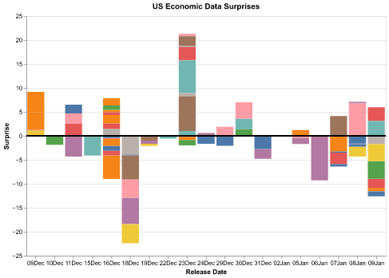
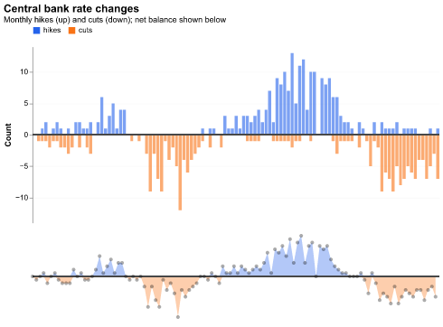
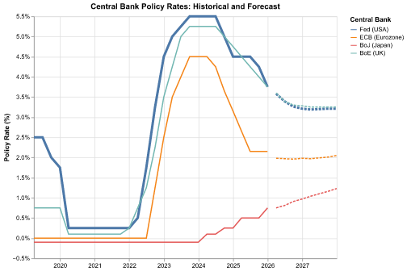
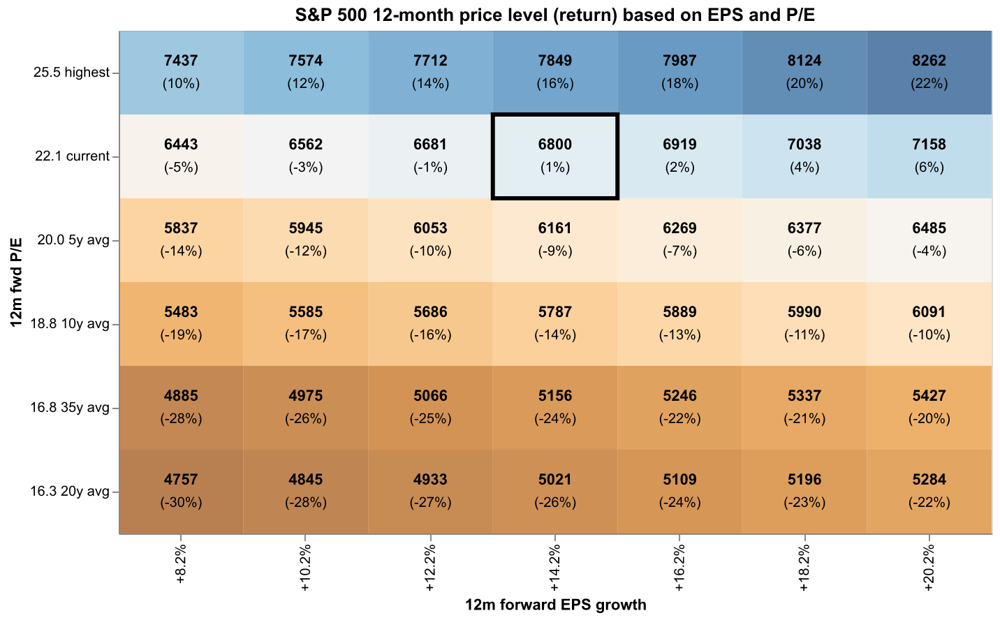
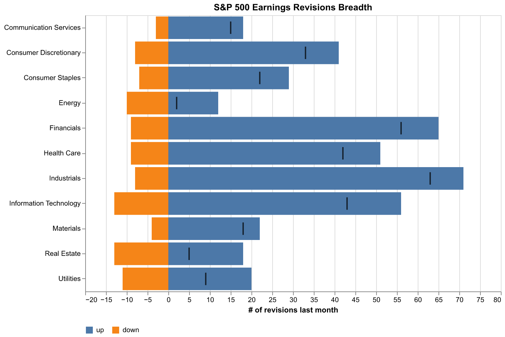
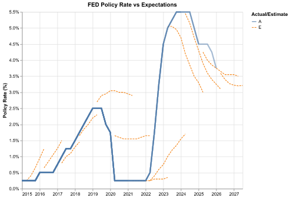

# Macro Examples

© 2026 Jim Domeij & Marek Ozana

These examples show how to use `polars-bloomberg` for macro analysis, inspired by ideas from my friend **Jim Domeij**. Thank you, Jim, for contributing your perspective and making it possible for others to learn from your macro thinking.

-   [{ loading=lazy }](us-eco-data-surprises.ipynb)
    **US Economic Data Surprises**

    Monitor economic surprise indices to track whether actual data is beating or missing expectations.
    [:material-open-in-new: Open](us-eco-data-surprises.ipynb)

-   [{ loading=lazy }](hikes-cuts-count.ipynb)
    **Central Bank Rate Changes (G20)**

    Monitor the breadth of global monetary policy by tracking monthly hikes and cuts across G20 central banks.
    [:material-open-in-new: Open](hikes-cuts-count.ipynb)

-   [{ loading=lazy }](cb-policy-rates.ipynb)
    **Central Bank Policy Rates**

    Compare realized policy rates with Bloomberg median forecasts across major central banks.
    [:material-open-in-new: Open](cb-policy-rates.ipynb)

-   [{ loading=lazy }](pe-valuations.ipynb)
    **Regional P/E Valuation**

    Compare regional forward P/E levels versus 10-year history.
    [:material-open-in-new: Open](pe-valuations.ipynb)

-   [{ loading=lazy }](spx-valuation-scenarios.ipynb)
    **SPX Valuation Scenarios**

    Explore S&P 500 fair value under changing P/E and EPS Growth assumptions.
    [:material-open-in-new: Open](spx-valuation-scenarios.ipynb)

-   [{ loading=lazy }](spx-earning-revisions-breadth.ipynb)
    **SPX Earnings Revisions Breadth**

    Monitor how earnings revisions are distributed across sectors.
    [:material-open-in-new: Open](spx-earning-revisions-breadth.ipynb)

-   [{ loading=lazy }](fed-history.ipynb)
    **Historical FED Policy Rates vs Expectations**

    Track how Fed funds rate forecasts shifted year by year versus realized policy.
    [:material-open-in-new: Open](fed-history.ipynb)

